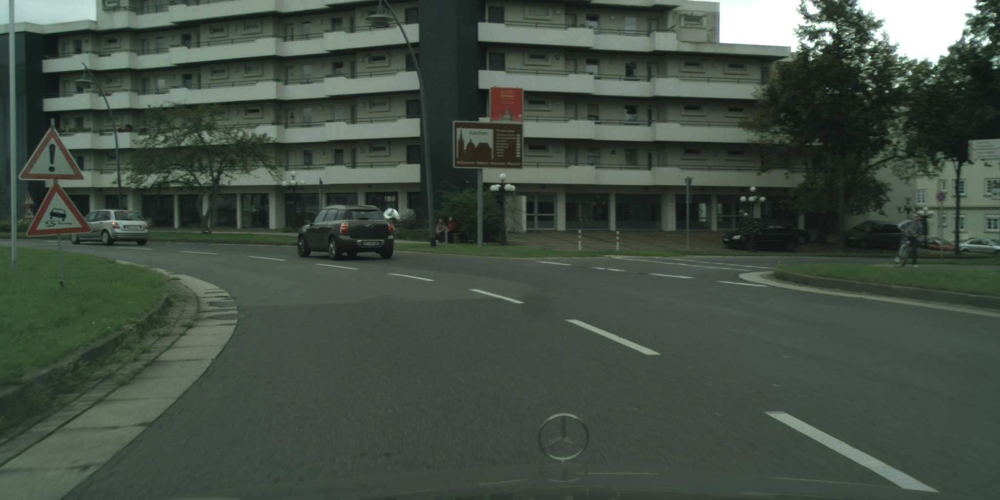
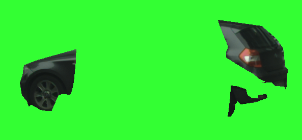
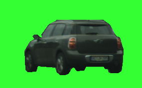

# Different GAN structures for generating Car Images from cityscapes dataset
## preprocessing
This repository generates car images from the cityscapes dataset with different GAN structures. The car images are generated using the gt mask labels from the cityscapes dataset, in particular the fine annotation dataset. Then a mask R-CNN is used to see if the mask R-CNN is able to predict a car, when it is able to predict a car then the image will be saved. The mask R-CNN will make sure that some car images that are obstructed by object will not be saved. This is done with the generate_car_images_cityscapes.py file. 

The original image and the images after the GT labels:

  

The picture on the left is an image that is obstructed, because of the mask R-CNN these don't get saved. The images on the right is the zoomed image after cropping the images using the bounding box produced from the mask R-CNN. 

  

## Models
GAN structures build:
- DCGAN
- Bigger DCGAN
- BigGAN
- ResNet GAN
- Latent Optimisation GAN 
- - LOGAN
- - Bidirectional LOGAN
- - ResNet GAN with Latent Optimisation
- - ResNet GAN with Self-Attention and Latent Optimisation

## Metrics 
During training we keep track of the FID socre and the IS score, the calculation of these scores is done with the GAN_metrics_FID_IS. 

## Hallucinated images
